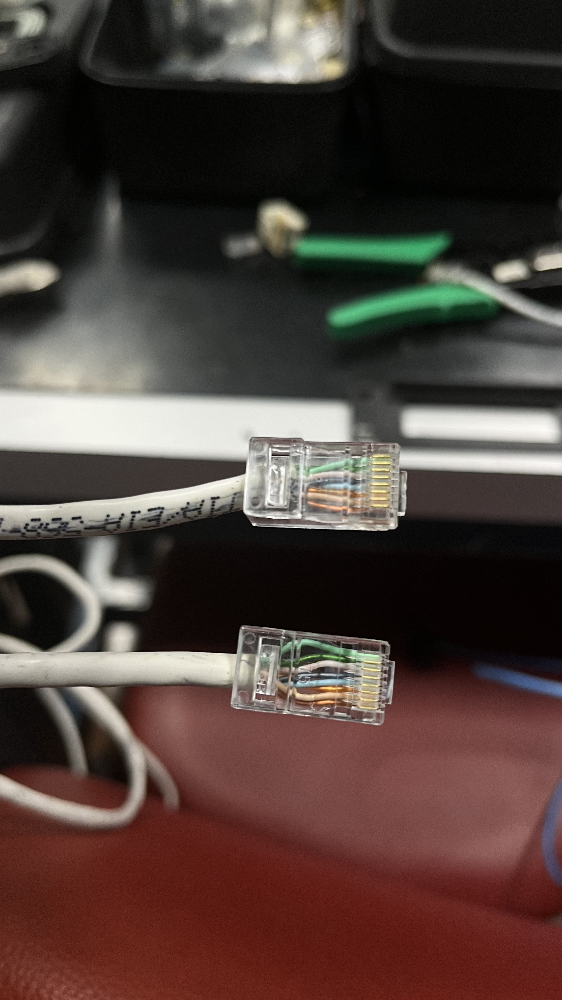
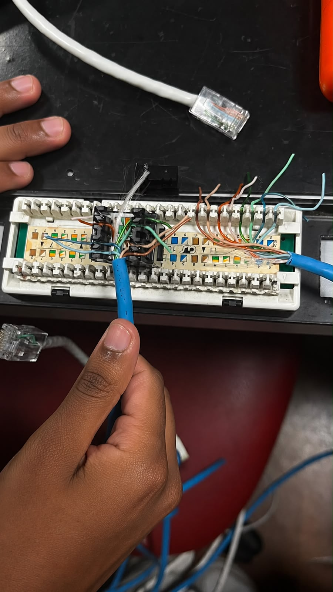

# portfolio-redes
# Projeto 01 - Infraestrutura Física de Redes

## Objetivo

Participar de uma atividade prática de infraestrutura de redes, envolvendo montagem de cabos, organização do cabeamento estruturado e instalação de equipamentos em rack.

## Descrição

Durante a aula prática da disciplina de Redes de Computadores, participei da montagem da infraestrutura física de uma rede.

As atividades incluíram a confecção de cabos de rede RJ-45, organização e conexão dos cabos em patch panel, instalação e fixação de racks, além da montagem e conexão de switches para compor a estrutura da rede.

## Atividades realizadas

- Montagem de cabo de rede RJ-45;
- Crimpagem dos conectores;
- Organização do cabeamento estruturado;
- Conexão dos cabos no patch panel;
- Instalação e fixação de racks;
- Montagem e conexão de switches;
- Identificação dos componentes da infraestrutura de rede.

## Ferramentas e equipamentos

- Cabo UTP
- Conector RJ-45
- Patch Panel
- Switch Cisco
- Rack de telecomunicações
- Alicate de crimpagem
- Ferramenta Punch Down

## Competências desenvolvidas

- Cabeamento estruturado
- Infraestrutura de redes
- Montagem de equipamentos
- Organização física de redes
- Instalação de switches
- Trabalho em equipe

## Imagens

### Cabo RJ-45

### Organização do Patch Panel

