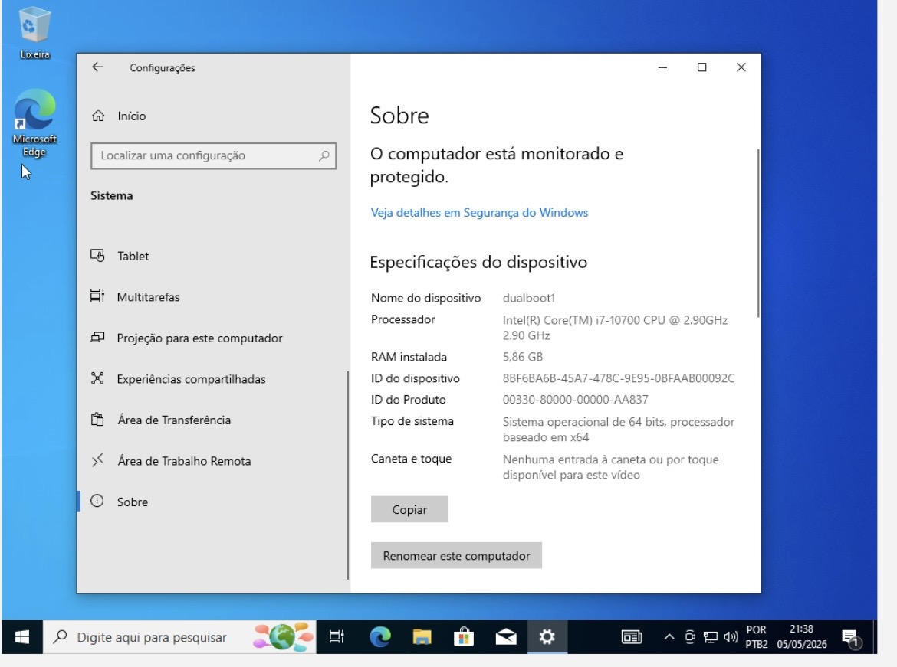
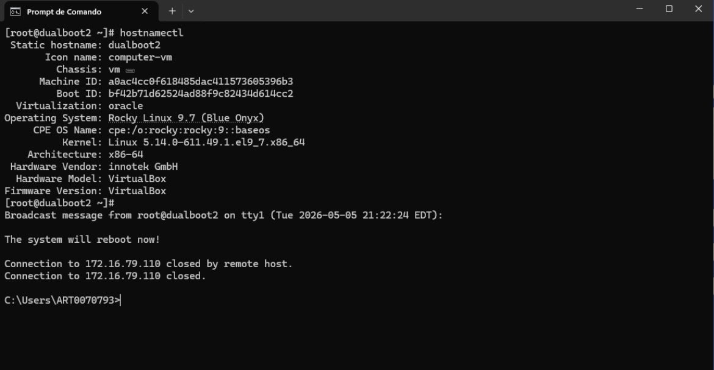
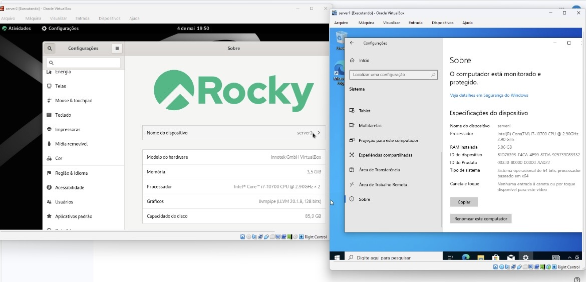

# Projeto 03 - Virtualização e Acesso Remoto via SSH

## Objetivo

Criar e configurar máquinas virtuais utilizando o Oracle VirtualBox, instalar os sistemas Windows 10 e Rocky Linux e realizar o acesso remoto via SSH.

## Descrição

Este projeto foi desenvolvido durante a disciplina de Estrutura de Computadores, com foco em virtualização e sistemas operacionais.

Foram criadas máquinas virtuais utilizando o Oracle VirtualBox, incluindo instalações do Windows 10 e Rocky Linux. Também foi realizada a configuração do serviço SSH no Linux e o teste de acesso remoto por meio do Prompt de Comando do Windows.

## Tecnologias utilizadas

- Oracle VirtualBox
- Windows 10
- Rocky Linux
- OpenSSH
- Prompt de Comando (CMD)

## Atividades realizadas

- Criação de máquinas virtuais;
- Configuração de CPU, memória RAM e armazenamento;
- Instalação do Windows 10;
- Instalação do Rocky Linux;
- Configuração do hostname;
- Configuração do serviço SSH;
- Teste de acesso remoto via SSH.

## Competências desenvolvidas

- Virtualização
- Sistemas Operacionais
- Administração Linux
- Administração Windows
- SSH
- Infraestrutura de TI

## Imagens

